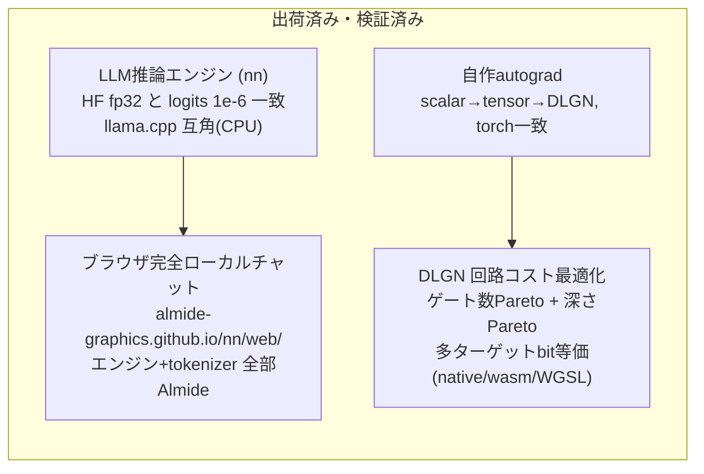
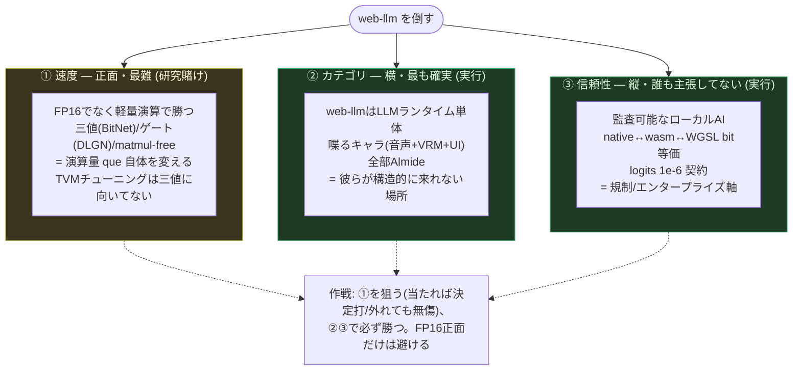
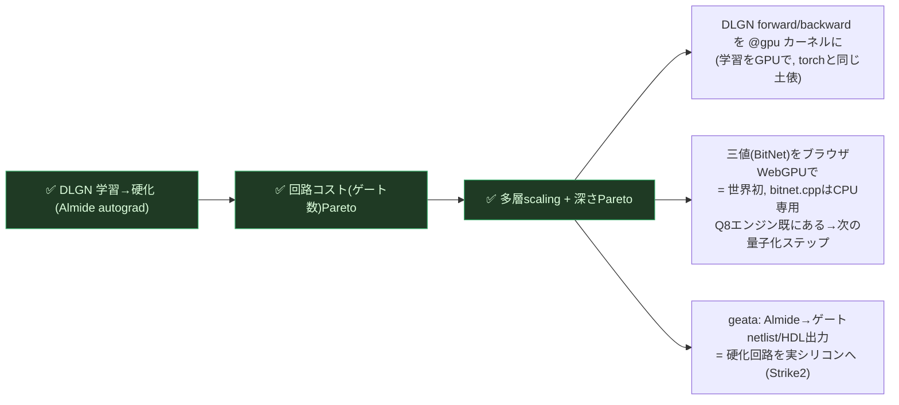
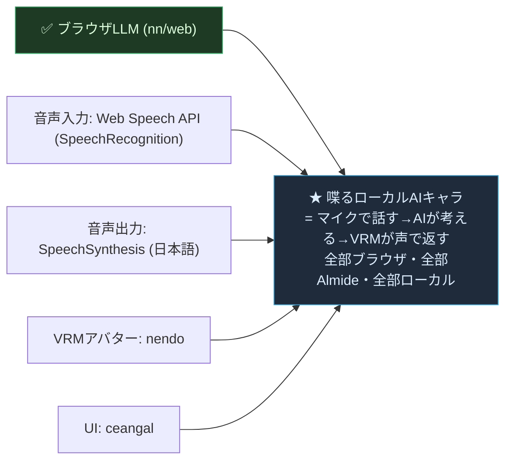
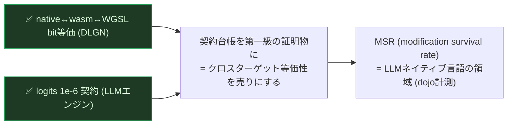
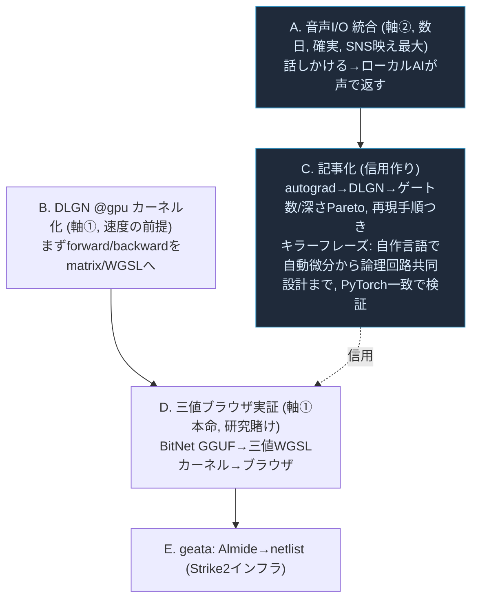

<!-- description: web-llm 打倒ロードマップ — FP16 Transformer正面を避け、①速度(三値/ゲート)②カテゴリ(喋るキャラ)③信頼性(監査可能)の3軸で包む。autograd→DLGN→ゲート数/深さPareto の研究成果を起点に -->
# Almide ロードマップ — web-llm 打倒 ＋ 検証可能ML回路共同設計

最終更新: 2026-06-15

> 旗: **web-llm を倒す。** ただし「FP16 Transformer を生tok/s で正面から」は
> 避ける（陳天奇/TVM の最強の一点）。彼らが弱い3方向から包む。

---

## 0. 現在地（証明済みの資産）

---

## 1. web-llm を倒す3つの軸

---

## 2. 軸① 速度（研究線）— 今日のDLGN研究がここに繋がる

web-llmが速いのは「普通のTransformerだから」。ゲート/三値は演算が根本的に
軽い。それがブラウザで動けば、web-llmが最適化しても追いつけない領域がある。

**速度の留保（正直に）**: 学習探索は torch が速い → torch をオラクルに使い続ける。
Almideの速度的価値は「学習」でなく「**検証可能な多ターゲット推論/デプロイ**」。
torch と同じトラックで競争しない。

---

## 3. 軸② カテゴリ（実行線）— 喋るローカルAIキャラ

部品は全部ある。統合するだけ。web-llm が原理的に作れないもの。

注意: VRM(nendo)とWhisperのブラウザ移植は未検証。音声I/O(Web Speech)は
ブラウザ標準で即実現可能 → **まず音声I/Oから**、VRMは次フェーズ。

---

## 4. 軸③ 信頼性（実行線）— 監査可能なローカルAI

---

## 5. 直近の優先順（次やること）

推奨初手: **A(音声I/O) と C(記事化) を並行**。Aは確実に映える・部品あり、
Cは今日までの研究を信用に変える。その後 B→D で速度の本命(軸①)へ。

---

## 6. 言ってはいけないこと（誇張封じ）

- 「CPU生tok/sで llama.cpp を超えた」→ NG。正: 「同条件で互角＋熱耐性で上」
- 「web-llmより速い」→ まだNG (軸①が当たるまで)。今言えるのは軸②③
- 「既存LLMより賢い」→ NG。これは効率・検証可能性・回路最適化の話
- モデルが小さい(0.6/1.7B)ので賢さは限定的、と先に線を引く

> 強い人は事実で積む。1桁以内の事実で勝負する方が、専門家には最強。
